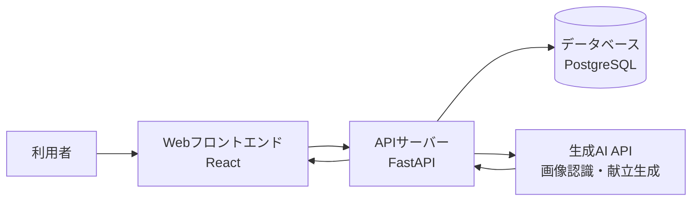

# 卒業制作作品報告書（記入例）

※本ファイルは `graduation_project_template.md` の記入例である。作品・人物・数値はすべて架空のものである。

## 1. 基本情報

- **作品名**：フードループ
- **英語タイトル**：FoodLoop: An AI-Powered Meal Planning App for Reducing Household Food Waste
- **制作者名**：瑞穂太郎（みずほたろう）
- **学籍番号**：非公開（個人情報保護のため、公開する報告書には記載しない）
- **所属ゼミ・研究室**：kklab
- **制作期間**：2025年4月〜2026年1月
- **作品の種類**：Webアプリ（生成AI利用）
- **作品URL**：https://foodloop.example.com
- **ソースコードURL**：https://github.com/example/foodloop
- **デモ動画URL**：https://video.example.com/foodloop-demo

---

## 2. 作品概要

### 2.1 概要

本作品は、家庭で発生する食品ロスを減らすことを目的に開発したWebアプリ「フードループ」である。主な利用者として、自炊の習慣が定着していない一人暮らしの社会人や学生を想定している。利用者が冷蔵庫にある食材をスマートフォンで撮影するか、テキストで入力すると、生成AIが消費期限の近い食材を優先して使い切るための献立を提案する。あわせて、廃棄せずに使い切れた食材の記録を自動で集計し、「今月削減できた食品ロスの量」と「節約できた金額」を可視化することで、利用者が継続的に食品ロス削減へ取り組む動機づけを行う。

### 2.2 一言で表すと

**本作品は、一人暮らしの社会人・学生が抱える「食材を買っても使い切れずに捨ててしまう」という問題を、生成AIによる食材優先型の献立提案と削減量の可視化によって解決するWebアプリである。**

### 2.3 作品の特徴

- 特徴1：冷蔵庫の写真から食材を自動認識し、入力の手間を最小限に抑えている。
- 特徴2：レシピの人気順ではなく「消費期限が近い食材を使い切ること」を最優先に献立を提案する。
- 特徴3：削減できた食品ロスの重量と金額を月次で可視化し、行動の継続を支援する。

---

## 3. 背景と問題意識

### 3.1 制作の背景

日本の食品ロス量は年間約470万トンと推計されており、その半分近くは家庭から発生しているとされる（農林水産省、2024年）。行政や企業による削減の取り組みは進んでいるが、家庭内の食品ロスは個人の生活習慣に依存するため、対策が届きにくい。制作者自身も一人暮らしを始めてから、特売でまとめ買いした野菜を使い切れずに捨てる経験を繰り返しており、「捨てたくて捨てている人はいないのに、なぜ捨ててしまうのか」という個人的な問題意識が本作品の出発点である。

### 3.2 解決したい課題

一人暮らしの社会人や学生は、仕事や学業で帰宅時間が不規則になりがちであり、計画的な食材管理が難しい。具体的には、（1）冷蔵庫に何が残っているかを外出先で思い出せず重複購入してしまう、（2）残った食材から献立を考えること自体が負担で外食に流れてしまう、（3）消費期限を過ぎてから気づき廃棄してしまう、という3つの場面で問題が発生している。

### 3.3 既存の方法とその限界

| 既存の製品・方法 | 主な特徴 | 課題・限界 |
|---|---|---|
| レシピ検索サイト | 料理名や食材名からレシピを検索できる | 「いま冷蔵庫にある食材の組み合わせ」からの逆引きが弱く、期限の近さを考慮できない |
| 食材管理アプリ | 購入した食材と期限を登録し通知する | 食材の手動登録が煩雑で継続しにくく、献立の提案までは行わない |
| 冷蔵庫の在庫メモ（紙・ホワイトボード） | 導入コストがゼロで手軽 | 更新を忘れやすく、外出先から確認できない |

---

## 4. 想定する利用者

### 4.1 主な利用者

- **利用者の属性**：一人暮らしの社会人・大学生（20〜30代）で、週2回以上は自炊をしたいと考えている人。
- **利用場面**：帰宅後に夕食の献立を考えるとき、および買い物前に冷蔵庫の在庫を確認するとき。
- **抱えている課題**：食材を使い切れずに廃棄してしまう。残り物から献立を考えるのが負担である。
- **作品を利用する目的**：考える負担なく、いまある食材を使い切る献立を決めたい。

### 4.2 ペルソナ

| 項目 | 内容 |
|---|---|
| 名前 | 佐藤花子（仮名） |
| 年齢・職業 | 26歳・IT企業勤務の会社員 |
| 生活環境 | 東京都内で一人暮らし。平日の帰宅は20時前後。週末にまとめ買いをする。 |
| 困っていること | 週末に買った野菜を平日に使い切れず、月に数回廃棄している。献立を考えるのが面倒で、疲れた日はコンビニ弁当に頼ってしまう。 |
| 現在の対処方法 | 冷蔵庫を開けて目についた食材で自己流の料理を作るか、レシピサイトを検索するが、検索結果と手持ちの食材が一致せず断念することが多い。 |
| この作品に期待すること | 冷蔵庫の中身を撮影するだけで、今夜作れる料理を具体的に提案してほしい。 |

### 4.3 その他のステークホルダー

- 家族：離れて暮らす親。子の食生活の乱れを心配しており、自炊の定着は安心材料になる。
- 学校・企業：食堂・社員食堂の運営者。家庭の自炊が増えると利用が減る可能性がある。
- 行政・地域社会：食品ロス削減目標を掲げる自治体。家庭系食品ロスの削減データは施策の参考になり得る。
- その他：食品スーパー。まとめ買いの適正化により購買行動が変化する可能性がある。

---

## 5. 提案する解決方法

### 5.1 コンセプト

本作品のコンセプトは「考えさせない食品ロス削減」である。食品ロスを減らすために利用者の意識改革や手間の追加を求めるのではなく、「今夜何を作るか」という毎日の意思決定をAIが肩代わりすることで、結果として食材が使い切られる状態をつくる。削減の努力を可視化して達成感に変換することで、義務感ではなく楽しさによる継続を狙う。

### 5.2 提供する価値

- 利用前：冷蔵庫の在庫を把握できず、献立を考えるのが負担で、食材を月に数回廃棄している。
- 利用後：撮影するだけで在庫が記録され、期限の近い食材を使う献立が毎日提案される。
- 期待される効果：食材廃棄の頻度が減り、食費が節約され、自炊の習慣が定着する。

### 5.3 主要機能

| 機能名 | 機能の説明 | 解決する課題 |
|---|---|---|
| 食材認識機能 | 冷蔵庫内の写真から食材の種類と量をAIが認識し、在庫リストに自動登録する | 手動登録の煩雑さによる利用の中断 |
| 献立提案機能 | 消費期限の近い食材を優先的に使う献立を、調理時間の希望に応じて3案提案する | 残り物から献立を考える負担 |
| ロス削減ダッシュボード | 使い切った食材の重量と金額を月次で集計し、グラフで表示する | 削減努力が実感できず継続しないこと |

---

## 6. SFプロトタイピング

### 6.1 想定する未来

- **想定年代**：2040年
- **場所・地域**：日本の地方中核都市の住宅地
- **社会の状況**：食料自給率の低下と輸入価格の高騰を受け、食料を「使い切る」ことが家計と社会の両面で重要な価値になっている。自治体単位で食品ロス削減目標が義務化されている。
- **技術の状況**：冷蔵庫にセンサーとカメラが標準搭載され、家庭内の食材在庫は本人の同意のもとで家電・アプリ間で共有される。生成AIによる生活支援エージェントが家庭に普及している。
- **人々の生活や価値観**：食材を捨てることは「もったいない」を超えて、電気の無駄遣いと同様の社会的マナー違反と見なされつつある。一方で、食の選択まで管理されることへの抵抗感も根強い。
- **現在と大きく異なる点**：食材の在庫情報が家庭内にとどまらず、地域の食材シェアリング網（余剰食材を近隣で融通する仕組み）と接続されている点。

### 6.2 未来に至るまでの変化

| 時期 | 社会・技術の変化 | 作品との関係 |
|---|---|---|
| 現在 | 家庭系食品ロスが社会課題として認知され始めている | 写真による在庫管理と献立提案で個人の行動を支援する |
| 3年後 | スマート冷蔵庫の低価格化により在庫の自動取得が一般化する | 撮影の手間がなくなり、在庫データが自動で連携される |
| 5年後 | 自治体が家庭の食品ロス削減にポイント制度を導入する | 削減実績データが自治体ポイントと接続され、利用の動機が強まる |
| 10年後 | 地域内で余剰食材を融通するシェアリング網が制度化される | 個人の使い切り支援から、地域全体の食材循環の基盤へと役割が拡大する |

### 6.3 未来社会の前提

- 技術的前提：食材認識AIの精度向上と、家電・アプリ間の在庫データ標準規格の策定。
- 経済的前提：食料価格の上昇が続き、使い切りの経済的価値が現在より大きくなっていること。
- 社会的前提：在庫データの共有に対する住民の理解と、地域内で食材を融通し合う互助的な文化の醸成。
- 法制度上の前提：家庭の消費データを保護するプライバシー法制と、個人間の食材譲渡に関する食品衛生上のルール整備。
- 環境上の前提：気候変動による不作が頻発し、食料の安定供給が現在より不確実になっていること。

### 6.4 未来の物語

> 2040年、地方都市の住宅地。  
> 大学生の美咲は、祖母から届いた段ボールいっぱいの白菜を前に途方に暮れていた。一人ではとても食べ切れない量である。  
>   
> 美咲が冷蔵庫に白菜をしまうと、フードループが在庫の急増を検知し、声をかけてきた。「白菜が2.4kg追加されました。今週の献立を白菜中心に組み直しますか？それとも、300m先の田中さんが白菜を探しています。1kgをおすそ分けしますか？」美咲は半分を献立に、半分をおすそ分けに回すことにした。夕方、受け取りに来た田中さんとは初対面だったが、「うちの柚子も持っていって」と柚子を2つ渡された。  
>   
> その夜、美咲の食卓には白菜と豚肉の重ね蒸しと、柚子の香りの浅漬けが並んだ。祖母にその写真を送ると、「ご近所と分け合うなんて、昔みたいだね」と返事が来た。フードループの画面には「今月、あなたの地域で融通された食材：128kg」と表示されている。しかしその一方で、美咲は少し考え込む。在庫を公開していない隣人が「付き合いの悪い人」と噂されていたのを思い出したからである。分かち合いが当たり前になった社会では、分かち合わない自由はどう守られるのだろうか。

### 6.5 未来における作品の役割

- 誰が利用するのか：単身世帯を中心に、食材を管理するすべての家庭と、余剰食材を融通し合う地域住民。
- いつ利用するのか：日々の献立決定時、買い物前、そして食材が余ったとき。
- どこで利用するのか：家庭の冷蔵庫・スマートフォン・地域のシェアリング拠点。
- どのような問題を解決するのか：家庭内の食品ロスと、地域内の食料の偏在。
- 社会にどのような影響を与えるのか：食材の循環を通じて、希薄化した近隣関係に緩やかな接点を生み出す。
- 作品が存在しない場合、何が起こるのか：食料価格の高騰下でも家庭の廃棄は減らず、余る家庭と足りない家庭の偏在が放置される。

### 6.6 未来画像


**図1：2040年において本作品が活用されている様子**

#### 画像の説明

夕暮れの住宅地の玄関先で、大学生がエコバッグに入れた白菜を年配の隣人に手渡している場面である。傍らのスマートフォンには、地域の食材融通マップと「白菜 1kg をおすそ分け」の確認画面が表示されている。背景の家々の窓には、在庫共有に参加している家庭を示す小さな緑のランプが灯っており、参加が可視化された社会の様子を描いている。

#### 画像生成に使用したプロンプト

```text
2040年の日本の住宅地、夕暮れ。大学生が玄関先で年配の隣人に白菜を手渡している。
そばのスマートフォン画面には地域の食材シェアリングマップが表示されている。
温かい色調、フォトリアリスティック、生活感のある構図。
```

- **使用した生成AI・ツール**：画像生成AIサービス（2025年12月時点の一般公開版）
- **生成日**：2025年12月10日
- **生成後に行った修正**：画面内のUIが実際の作品と異なっていたため、画像編集ソフトでアプリ画面部分を実機のスクリーンショットに差し替えた。
- **画像中で特に注目してほしい点**：窓辺の緑のランプ。共有への「参加」が外から見える社会の便利さと息苦しさを同時に表現している。

### 6.7 未来から現在へのバックキャスティング

1. 現在取り組むべきこと：写真による食材認識の精度向上と、個人の食品ロス削減を習慣化させるUXの確立。
2. 3年以内に必要となる変化：スマート冷蔵庫・家計簿アプリなどと在庫データを連携するためのAPI公開と標準化への参加。
3. 5年以内に必要となる技術・制度：自治体の食品ロス削減施策と連動するデータ提供の仕組みと、消費データのプライバシー保護規定の整備。
4. 作品の実用化に向けた課題：個人間の食材譲渡に伴う衛生・責任問題の整理と、共有に参加しない自由を守る設計（在庫非公開のデフォルト化）。

---

## 7. 利用シナリオ

### 7.1 基本的な利用の流れ

1. 利用者が冷蔵庫の中をスマートフォンで撮影する。
2. システムが写真から食材の種類と量を認識し、在庫リストを更新する。
3. システムが各食材の推定消費期限を算出し、期限の近い順に並べ替える。
4. 利用者に「期限の近い食材を使う献立」を調理時間別に3案提示する。
5. 利用者が献立を選択すると、レシピと不足食材の買い物リストが表示される。
6. 調理後、利用者が「作った」ボタンを押すと、使用した食材が在庫から差し引かれ、削減実績に加算される。

### 7.2 ユーザーストーリー

> 一人暮らしの会社員として、  
> 疲れて帰った日でも冷蔵庫の食材を無駄にしないために、  
> 写真を撮るだけで今夜の献立を提案してくれる機能を利用したい。  
> それによって、考える負担なく食材を使い切り、食費の節約と自炊の継続を実現できる。

### 7.3 具体的な利用例

#### 利用例1：通常時

- 利用者：一人暮らしの会社員（26歳）
- 利用状況：平日20時に帰宅し、夕食の献立を決めたい。
- 操作：アプリを開き、冷蔵庫内を1枚撮影する。
- システムの反応：「小松菜（期限まで1日）」を最優先に、調理時間15分・30分・45分の献立を3案提示する。
- 得られる結果：15分の「小松菜と豚肉のオイスター炒め」を選び、期限切れ直前の小松菜を使い切る。

#### 利用例2：問題発生時

- 利用者：同上
- 利用状況：撮影した写真が暗く、食材の一部が認識されなかった。
- 操作：認識結果の確認画面で、認識漏れの「木綿豆腐」を候補リストから手動で追加する。
- システムの反応：追加された豆腐を在庫に反映し、献立を再計算する。あわせて「明るい場所で撮影すると認識精度が上がります」と案内を表示する。
- 得られる結果：手動補正により正しい在庫に基づく献立提案を受けられる。

---

## 8. 画面と操作方法

### 8.1 画面構成


**図2：作品のメイン画面**

メイン画面は「今日の提案」を最上部に配置し、アプリを開いた瞬間に献立の意思決定が完了することを目的としている。主要な表示項目は、（1）本日の献立3案、（2）期限が近い食材の警告リスト、（3）今月のロス削減量と節約金額のサマリーである。

### 8.2 操作手順

1. ホーム画面を開く。
2. カメラボタンを押し、冷蔵庫内を撮影する。
3. 認識結果を確認し、必要に応じて修正して「確定」ボタンを押す。
4. 提案された献立3案から1つを選択する。
5. レシピを見ながら調理し、完了後に「作った」ボタンを押す。

### 8.3 その他の画面

#### 入力画面


食材の撮影と認識結果の修正を行う画面である。認識された食材はカード形式で表示され、タップで数量や期限を修正できる。

#### 結果画面


月次のロス削減ダッシュボードである。削減した食材の重量、節約金額、連続自炊日数をグラフで表示する。

---

## 9. システム構成

### 9.1 システム全体像



### 9.2 使用技術

| 分類 | 使用技術 | 使用目的 |
|---|---|---|
| フロントエンド | React 18、TypeScript | 画面表示とカメラ撮影UIの実装 |
| バックエンド | Python 3.12、FastAPI | 在庫管理・献立提案のAPI実装 |
| データベース | PostgreSQL 16 | 在庫・献立履歴・削減実績の保存 |
| AI・機械学習 | Claude API（Anthropic） | 写真からの食材認識と献立の生成 |
| 外部API | レシピ栄養情報API | 提案献立の栄養価の参考表示 |
| 開発環境 | VS Code、GitHub、Docker | 開発・バージョン管理・環境の統一 |
| 公開環境 | クラウドホスティングサービス | アプリの公開とデモ環境の提供 |

### 9.3 データの流れ

- 入力データ：冷蔵庫内の写真、食材の手動修正内容、調理完了の報告、調理時間の希望。
- 処理内容：写真から食材と量を認識し、食材ごとの標準的な消費期限を付与して在庫を更新する。在庫と希望条件をもとに生成AIが献立を作成する。
- 保存するデータ：在庫リスト、献立の選択履歴、削減実績の集計値。写真は認識処理の完了後に削除し、保存しない。
- 出力データ：献立3案（レシピ・調理時間・使用食材）、不足食材の買い物リスト、月次の削減レポート。
- 外部サービスとの連携：生成AI APIへ食材リストを送信して献立を受け取る。個人を特定できる情報は送信しない。

---

## 10. AI・エージェントの利用

### 10.1 AIの役割

- 文章生成：在庫食材を使う献立とレシピ手順の生成。
- 画像生成：（本編機能では未使用。SFプロトタイピングの未来画像作成にのみ使用。）
- 分類・予測：写真からの食材の種類・量の認識と、消費期限の推定。
- 推薦：利用者の調理履歴に基づく献立3案の優先順位づけ。
- 対話：（未使用）
- 意思決定支援：「今夜どれを作るか」の選択肢を3案に絞り込むことによる意思決定の負担軽減。
- その他：認識に失敗した際の修正候補の提示。

### 10.2 AIを利用する理由

食材の組み合わせは膨大であり、「期限の近さ」「調理時間」「利用者の好み」を同時に満たす献立をあらかじめルールとして記述することは現実的でない。特に、中途半端に残った食材（例：キャベツ4分の1と卵2個と余った餃子の皮）から実際に作れる料理を柔軟に構成する処理は、条件分岐やレシピデータベースの検索だけでは実現が難しく、生成AIの利用が必要であった。

### 10.3 AIへの入力と出力

| 項目 | 内容 |
|---|---|
| AIへの入力 | 在庫食材リスト（名称・量・推定期限）、希望調理時間、避けたい食材、直近1週間の献立履歴 |
| AIが行う処理 | 期限の近い食材を優先して使い切る献立の構成と、レシピ手順の生成 |
| AIからの出力 | 献立3案（料理名・使用食材と使用量・手順・調理時間）のJSONデータ |
| 出力の利用方法 | アプリが検証（実在しない在庫の使用や分量超過のチェック）を行ったうえで画面に表示する |

### 10.4 プロンプト設計

```text
あなたは家庭料理の献立アドバイザーである。以下の在庫食材リストから、
消費期限が近い食材を優先して使い切る夕食の献立を3案提案せよ。

条件：
- 調理時間は{希望時間}分以内とする。
- 在庫にない食材は、調味料を除き使用しない。
- 各案は難易度を変え、1案は初心者でも作れるものにする。
- 出力は指定のJSON形式に従うこと。

在庫食材リスト：
{名称、量、期限までの日数の一覧}

避けたい食材：{利用者設定}
直近の献立履歴：{7日分の料理名}
```

### 10.5 誤りへの対策

- 出力内容の検証：AIの出力を表示前にプログラムで検証し、在庫にない食材の使用や在庫量を超える分量が含まれる場合は再生成する。
- 利用者への注意表示：推定消費期限はあくまで目安であり、食材の状態を自分の目で確認するよう常時表示している。特にアレルギーについては、レシピ画面に「アレルギーがある場合は使用食材を必ず確認してください」と警告を表示する。
- 禁止事項の設定：プロンプトで、生食が危険な食材の生食レシピや、加熱不足となり得る手順の生成を禁止している。
- 人間による確認：認識された食材リストは必ず利用者が確認・修正してから確定する設計とし、AIの認識結果をそのまま自動確定しない。
- 個人情報の除去：AIへの送信データは食材リストと匿名の設定情報のみとし、氏名・位置情報などの個人情報は送信しない。

---

## 11. 制作過程

### 11.1 制作スケジュール

| 時期 | 実施内容 | 成果・課題 |
|---|---|---|
| 第1段階（2025年4〜5月） | アイデア検討 | 自身の食材廃棄の記録とゼミ生10名への聞き取りから課題を特定した |
| 第2段階（2025年6〜7月） | 設計 | 画面設計・データ設計・プロンプト設計を行い、ゼミ発表で「入力の手間」への指摘を受け写真認識の採用を決定した |
| 第3段階（2025年8〜10月） | プロトタイプ制作 | 献立提案の中核機能を実装した。食材認識の精度が当初想定を下回る課題が判明した |
| 第4段階（2025年11月） | テスト | ゼミ生10名による2週間の利用者テストを実施した |
| 第5段階（2025年12月〜2026年1月） | 改良・完成 | テスト結果をもとに認識修正UIを改善し、ダッシュボード機能を追加した |

### 11.2 制作中に発生した問題

- 問題：冷蔵庫の写真からの食材認識で、袋や容器に入った食材の認識率が低かった（初期テストで約60%）。
- 原因：冷蔵庫内は照明が暗く食材が重なり合っており、一般的な物体認識が想定する撮影条件と大きく異なっていた。
- 対応：1枚の写真で全体を認識する方式から、棚ごとに撮影する分割撮影方式に変更し、さらに認識結果を利用者が確認・修正するUIを必須の手順として組み込んだ。
- 結果：認識率は約85%に向上し、残る誤認識も利用者の修正で運用上の問題がなくなった。
- 学んだこと：AIの精度を100%に近づけることに固執するより、誤りを前提に人間が修正しやすい設計にする方が、実用性への近道である場合があること。

### 11.3 当初案からの変更点

| 当初の計画 | 変更後 | 変更した理由 |
|---|---|---|
| 食材をバーコードと手入力で登録する | 冷蔵庫内の写真から自動認識する | ゼミでの中間発表で「登録が面倒だと続かない」との指摘が多く、継続利用の最大の障壁と判断したため |
| 献立を1案のみ提案する | 調理時間別に3案提案する | 利用者テストで「提案が口に合わないと使うのをやめてしまう」との意見があり、選択の余地を残すため |
| 写真をサーバーに保存する | 認識処理後に即時削除する | プライバシーへの配慮と、保存する必要性がないことを設計段階で再検討したため |

---

## 12. 評価

### 12.1 評価方法

以下の2つの方法で評価を実施した。

- 利用者テスト：ゼミ生10名に2週間、日常生活の中で実際に利用してもらい、利用後にアンケートとインタビューを実施した。
- 処理精度の測定：食材認識機能について、テスト用に撮影した冷蔵庫写真50枚を用いて認識率を測定した。

### 12.2 評価対象

- 参加者数：10名
- 参加者の属性：本学の学生（うち一人暮らし7名、実家暮らし3名、20〜23歳）
- 実施期間：2025年11月10日〜11月24日（2週間）
- 実施環境：各参加者の自宅で、参加者自身のスマートフォンを使用

### 12.3 評価項目

| 評価項目 | 評価方法 | 結果 |
|---|---|---|
| 使いやすさ | 5段階評価 | 平均4.1 |
| 有用性 | 5段階評価 | 平均4.3 |
| 分かりやすさ | 5段階評価 | 平均4.5 |
| 継続利用意向 | 5段階評価 | 平均3.8 |

### 12.4 評価結果

有用性は平均4.3と高く、自由記述では「期限切れ直前の食材を意識するようになった」（8名）、「献立を考える時間が減った」（7名）という回答が多かった。一人暮らしの参加者7名のうち5名が、テスト期間中の食材廃棄が「減った」と回答した。一方、継続利用意向は平均3.8と他項目より低く、インタビューでは「撮影を忘れると在庫がずれて提案が的外れになる」（4名）という指摘があった。食材認識率はテスト写真50枚に対して85.2%であり、誤認識は主に半透明の保存容器に入った食材で発生した。

### 12.5 評価結果を受けた改善

- 指摘された問題：撮影を忘れると在庫データが実際とずれ、献立提案の精度が下がる。
- 実施した改善：買い物の多い曜日・時間帯を学習し、撮影を促す通知機能を追加した。また、献立選択時に「この食材はもうない」ボタンで在庫を即時修正できるようにした。
- 改善後の結果：改善版を4名に1週間再テストした結果、在庫のずれに関する不満は挙がらず、通知をきっかけに撮影した回数は1人あたり平均3.5回であった。

---

## 13. 倫理的・法的・社会的課題

### 13.1 個人情報とプライバシー

- 取得する個人情報：メールアドレス（ログイン用）、食材の在庫・献立履歴。冷蔵庫の写真は認識処理後に即時削除し、保存しない。
- 保存方法：クラウド上のデータベースに暗号化して保存し、アクセスは本人のアカウントに限定する。
- 利用目的：献立提案と削減実績の集計のみに利用し、他の目的には使用しない。
- 削除方法：アカウント削除機能により、利用者自身がすべてのデータを削除できる。
- 第三者への提供の有無：第三者への提供は行わない。生成AI APIへの送信は食材リストのみとし、個人を特定できる情報を含めない。

### 13.2 安全性

最も重大なリスクは、消費期限の推定を利用者が過信し、実際には傷んだ食材を食べてしまうことである。本作品の期限はあくまで一般的な目安による推定であり、実際の食材の状態を保証するものではない。このため、レシピ表示時に必ず「食材の状態はご自身の目と匂いで確認してください」という注意を表示し、期限推定を「安全の保証」ではなく「使い切りの優先順位づけ」として位置づけている。また、アレルギー対応は避けたい食材の設定に依存するため、設定漏れの可能性を前提に、使用食材の一覧を献立選択前に必ず表示する設計とした。

### 13.3 公平性と偏り

生成AIが提案する献立は学習データの影響を受けるため、特定の食文化（例：一般的な和洋中）に偏り、宗教上・信条上の食の制約や地域の食文化への対応が不十分になる可能性がある。本作品では避けたい食材の設定で一部に対応しているが、根本的な解決には至っていない。また、スマートフォンの操作や撮影が難しい高齢者などは本作品の恩恵を受けにくく、食品ロス削減支援が「使える人」に偏る構造的な課題がある。

### 13.4 著作権・知的財産権

- 使用した画像・音声・文章：アプリ内のアイコンはオープンソースのアイコンセット（MITライセンス）を使用した。
- 使用したオープンソースソフトウェア：React、FastAPI、PostgreSQL ほか（詳細は第18章に記載）。
- 使用したライセンス：MITライセンス、Apache License 2.0、PostgreSQL License。
- 生成AIによる制作物の扱い：AIが生成したレシピは既存レシピの複製とならないよう、料理名・手順を制作者が確認した。未来画像は生成AIで作成したことを本報告書に明記し、プロンプトを記録している。

### 13.5 未来社会における負の影響

- 依存の発生：献立の決定をAIに委ね続けることで、自分で料理を構想する力が育たなくなる可能性がある。
- 雇用への影響：本作品単体の影響は小さいが、外食・中食産業の需要が減少する可能性がある。
- 人間関係への影響：6章の未来物語で描いたとおり、在庫共有が普及した社会では、共有しない人への同調圧力が生じ得る。
- 格差の拡大：スマートフォンやスマート家電を持たない世帯が、削減支援やポイント制度の恩恵から取り残される可能性がある。
- 監視や管理の強化：家庭の食材データが自治体や企業に集約されれば、食生活の監視につながる恐れがある。
- 技術を利用できない人への影響：高齢者・障がいのある人が食品ロス削減施策の枠外に置かれる可能性がある。
- 想定外の利用方法：削減実績を競う機能が過度な節約や欠食を助長する可能性がある。

### 13.6 対策

技術的対策として、在庫データの共有・外部連携はすべてオプトイン（初期設定は非公開）とし、共有しないことによる機能制限を設けない設計を維持する。制度的対策として、実用化の際は消費データの利用目的を限定する利用規約と第三者提供の禁止を明示する。社会的対策として、削減実績の表示は他者との比較ランキングではなく過去の自分との比較を基本とし、競争や同調圧力を煽らないUIを原則とする。

---

## 14. 独自性と新規性

### 14.1 独自性

既存のレシピ検索サービスが「作りたい料理」から出発するのに対し、本作品は「使い切るべき食材」から出発する点に独自性がある。また、既存の食材管理アプリの多くが手動登録を前提とするのに対し、本作品は写真1枚からの自動認識と修正UIの組み合わせにより、登録の負担を大幅に下げた。さらに、削減量・節約額の可視化を組み込み、「管理」ではなく「達成」の体験として食品ロス削減を再設計した点が既存サービスとの違いである。

### 14.2 技術的な工夫

- 工夫した点1：生成AIの出力をJSON形式に固定し、在庫との整合性をプログラムで検証してから表示することで、実在しない食材を使う「幻覚」レシピを排除した。
- 工夫した点2：冷蔵庫の棚ごとの分割撮影方式により、暗所・重なりによる認識率低下を実用水準まで改善した。
- 工夫した点3：AIの誤認識を前提に、確認・修正を1タップで行えるカード型UIを設計し、精度の限界をUXで補った。

### 14.3 SFプロトタイピングとしての意義

> 本作品が提示する中心的な問いは、「食を無駄にしない社会は、食の自由を狭めずに実現できるのか」「家庭の食のデータは誰のものか」「分かち合いが制度化された社会で、分かち合わない自由はどう守られるのか」である。

未来物語では、食材の地域共有がもたらす豊かさと、共有への同調圧力という影の両面を描いた。技術による最適化と個人の自由のバランスをどこに置くべきかを、読み手が自分の生活に引きつけて考えるきっかけとすることが、本作品のSFプロトタイピングとしての意義である。

---

## 15. 制約と今後の課題

### 15.1 現時点での制約

- 未実装の機能：買い物リストのECサイト連携、家族など複数人での在庫共有。
- 技術上の制約：半透明容器内の食材や自家製の作り置きは認識できず、手動登録が必要である。
- データ上の制約：消費期限の推定は食材ごとの一般的な目安に基づいており、保存状態を反映できない。
- 評価上の制約：評価参加者が学生10名に限られ、社会人や幅広い年齢層での有効性は未検証である。廃棄量の減少も自己申告に基づく。
- 利用環境の制約：スマートフォンのカメラとインターネット接続が必須である。

### 15.2 今後追加したい機能

1. 購入した食材のレシート撮影による在庫登録（買い物直後の入力を簡略化する）。
2. 冷凍保存の提案機能（使い切れない食材に廃棄以外の選択肢を提示する）。
3. 削減実績の匿名統計をもとにした、自治体の食品ロス施策へのデータ提供（本人同意を前提とする）。

### 15.3 実用化に向けた課題

- 技術面：多様な家庭環境での認識精度の検証と、スマート冷蔵庫との連携API対応。
- 費用面：生成AI APIの利用料金を賄う収益モデル（フリーミアム等）の設計。
- 法制度面：食品衛生に関する情報提供の責任範囲の明確化と、プライバシーポリシーの整備。
- 運用面：食材データベースの継続的な更新と、問い合わせ対応の体制。
- 社会的受容：期限推定への過信を防ぐリスクコミュニケーション。
- 利用者教育：撮影のコツや在庫修正の方法を伝えるオンボーディングの拡充。

---

## 16. 制作を通じて学んだこと

### 16.1 技術面で学んだこと

生成AIをアプリに組み込む際は、AIの出力をそのまま信頼せず、構造化された形式で受け取り検証する層を挟むことが不可欠だと学んだ。また、認識精度のような数値目標を追うだけでなく、誤りを人間が簡単に直せるUIを用意する方が全体の体験を大きく改善することを、利用者テストを通じて実感した。

### 16.2 企画・設計面で学んだこと

当初は多機能な構想だったが、中間発表での指摘を受けて「撮影→提案→作る」の一連の流れに機能を絞ったことで、作品の価値が明確になった。利用者が本当に困っている瞬間（疲れて帰宅した夜）を具体的に想定することが、機能の取捨選択の判断基準になると学んだ。

### 16.4 今後に生かしたいこと

課題の当事者（今回は自分自身とゼミ生）の観察から出発し、プロトタイプを早く作って実際に使ってもらい、指摘をもとに割り切って設計を変える、という進め方を今後の開発でも実践したい。また、SFプロトタイピングを通じて「便利さの先にある社会的な影響」まで考える習慣を、技術者としての判断に生かしたい。

---

## 17. まとめ

本作品「フードループ」は、一人暮らしの社会人・学生が食材を使い切れずに廃棄してしまう問題に対し、写真1枚からの食材認識と、期限の近い食材を優先する生成AIの献立提案、削減実績の可視化によって取り組んだWebアプリである。ゼミ生10名による2週間の利用者テストでは有用性が平均4.3と評価され、一人暮らしの参加者7名中5名が食材廃棄の減少を実感した。一方で、在庫データの鮮度維持という継続利用上の課題も明らかになり、通知機能などの改善を行った。SFプロトタイピングでは、食材が地域で循環する2040年の社会を描き、食品ロス削減の理想の先にある「共有への同調圧力」という論点を提示した。技術による食の最適化と個人の自由をどう両立させるかという問いを、本作品の今後の開発においても指針としたい。

---

## 18. 参考文献・参考資料

### 書籍・論文

1. 農林水産省（2024）『食品ロス量の推計結果（令和4年度）』農林水産省。
2. 山田花子（2023）「家庭系食品ロスの発生要因と削減行動に関する研究」『環境情報学会誌』12（3）、45-58頁。

### Webサイト

1. 消費者庁「食品ロス削減特設サイト」https://www.caa.go.jp/policies/policy/consumer_policy/information/food_loss/（最終閲覧日：2026年1月10日）
2. 環境省「食品ロスポータルサイト」https://www.env.go.jp/recycle/foodloss/（最終閲覧日：2026年1月10日）

### 使用したソフトウェア・ライブラリ

- ソフトウェア名：React／バージョン：18.3／URL：https://react.dev／ライセンス：MITライセンス
- ソフトウェア名：FastAPI／バージョン：0.115／URL：https://fastapi.tiangolo.com／ライセンス：MITライセンス
- ソフトウェア名：PostgreSQL／バージョン：16／URL：https://www.postgresql.org／ライセンス：PostgreSQL License

### 使用した生成AI

| サービス・モデル | 使用目的 | 使用した範囲 |
|---|---|---|
| Claude API（Anthropic） | 食材認識・献立生成（作品の機能）、実装時のコード補助 | 出力はプログラムと制作者が検証。コードは制作者が理解・修正のうえ採用 |
| 画像生成AIサービス | SFプロトタイピングの未来画像の作成 | プロンプトと修正内容を第6章に記録 |

---

## 19. 生成AI利用記録

### 19.1 生成AIを利用した作業

- アイデア出し：機能の候補出しの壁打ち相手として利用した。
- 文章作成：本報告書の下書きの一部（第3章の背景整理）で構成案の提案を受けた。
- プログラミング：食材認識APIの呼び出し処理と、JSON検証処理の実装補助に利用した。
- デバッグ：非同期処理のエラー原因の調査に利用した。
- 画像生成：第6章の未来画像の作成に利用した。
- データ分析：（未使用）
- その他：利用者テストのアンケート項目案の検討に利用した。

### 19.2 制作者自身が行った判断・修正

生成AIの提案はあくまで素材として扱い、採用の判断はすべて制作者自身が行った。具体的には、（1）機能のアイデア出しでは、AIが提案した「家族間の在庫共有」「栄養バランス採点」等の候補から、卒業制作の期間内に検証可能な範囲として食材認識と献立提案に絞る判断を制作者が行った。（2）コード補助では、AIが生成した在庫検証処理に浮動小数点の比較による不具合の可能性を見つけ、制作者が修正した。（3）報告書の文章は、AIの構成案を参考にしつつ、内容と表現はすべて制作者が自分の言葉で書き直し、事実関係（統計値・テスト結果）を一次資料と照合した。

### 19.3 代表的な対話例

```text
入力した指示：
FastAPIで、生成AIが返した献立JSONに在庫にない食材が含まれていないか検証する
関数を書いてほしい。在庫は {"食材名": 残量g} の辞書で持っている。

生成AIの出力：
（献立内の各食材について在庫辞書に存在するかを確認し、存在しない場合は
エラーリストに追加して返す関数のコードが出力された。分量の比較は
「使用量 <= 残量」の単純比較で実装されていた。）

制作者による評価・修正：
存在チェックの構造はそのまま採用した。ただし、分量比較が浮動小数点の
等値近傍で誤判定する可能性と、「少々」「適量」など数値化できない分量の
考慮が漏れていたため、許容誤差の導入と非数値分量の除外処理を制作者が
追加した。修正後、境界値のテストケースを自作して動作を確認した。
```

---

## 20. 付録

### 20.1 インストール方法

```bash
# リポジトリを取得
git clone https://github.com/example/foodloop.git
cd foodloop

# 必要なライブラリをインストール
pip install -r requirements.txt
cd frontend && npm install && cd ..

# 環境変数を設定（APIキー等は .env.example を参照）
cp .env.example .env

# アプリケーションを起動
docker compose up
```

### 20.2 動作環境

- OS：Windows 11／macOS 14 以降（開発・確認済み環境）
- ブラウザ：Google Chrome 最新版、Safari 最新版
- Python／Node.js等のバージョン：Python 3.12、Node.js 20
- 必要な外部サービス：生成AI API（Claude API）
- 必要なAPIキー：Claude APIキー（.env に設定）

### 20.3 テスト用アカウント

- ユーザー名：demo@foodloop.example.com
- パスワード：（デモ専用パスワードを審査担当者に別途連絡）

※公開しても問題のないデモ専用アカウントのみを記載している。

### 20.4 その他の画像


**図3：利用者テストで用いたロス削減ダッシュボードの表示例**

### 20.5 関連ファイル

- 企画書：`docs/proposal.pdf`
- 発表資料：`docs/final-presentation.pdf`
- デモ動画：https://video.example.com/foodloop-demo
- アンケート用紙：`docs/survey-form.pdf`
- 集計データ：`docs/survey-results.xlsx`
