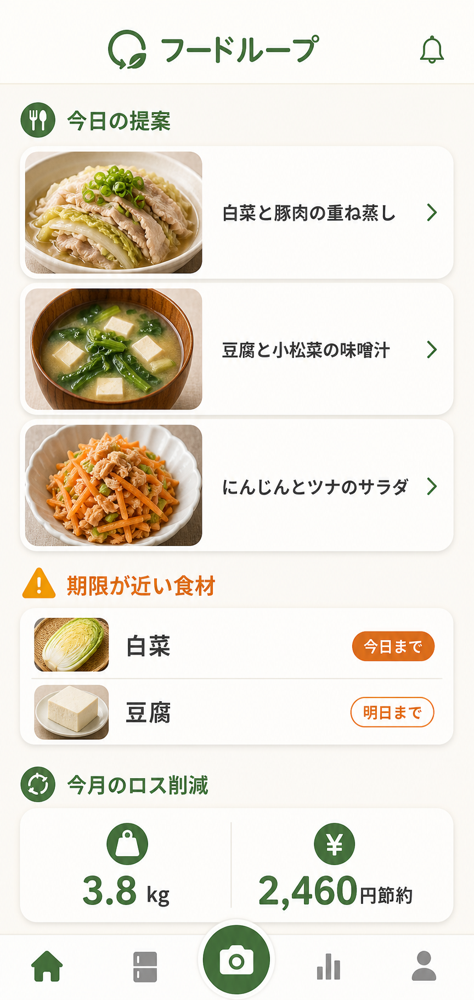
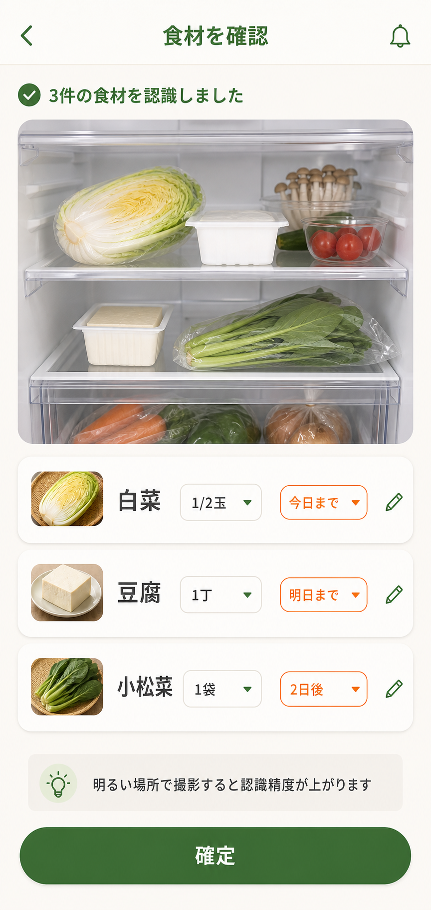
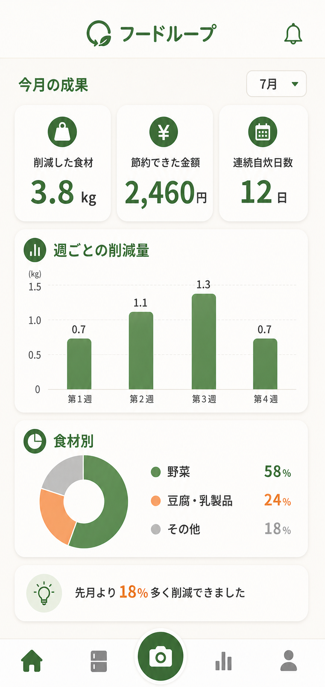
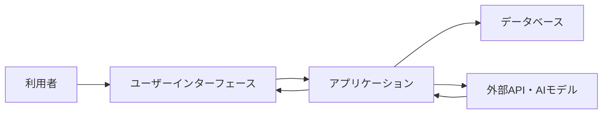
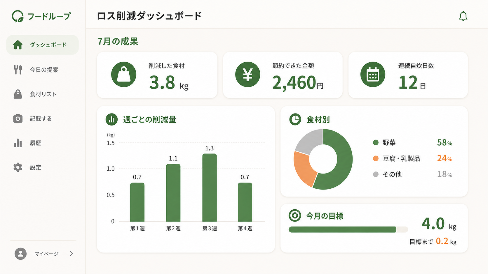

# 卒業制作作品報告書

## 1. 基本情報

- **作品名**：
- **英語タイトル**：
- **制作者名**：
- **学籍番号**：非公開（個人情報保護のため、公開する報告書には記載しない）
- **所属ゼミ・研究室**：
- **制作期間**：
- **作品の種類**：  
  例：Webアプリ、スマートフォンアプリ、AIエージェント、IoTシステム、ゲーム、映像作品、データ分析システム
- **作品URL**：
- **ソースコードURL**：
- **デモ動画URL**：

---

## 2. 作品概要

### 2.1 概要

作品の目的、対象者、主要な機能を、200〜400字程度で簡潔に説明してください。

> 記入例：  
> 本作品は、〇〇という課題を解決するために開発した〇〇である。主な利用者として〇〇を想定しており、〇〇、〇〇、〇〇の機能を提供する。

### 2.2 一言で表すと

> 「誰の、どのような問題を、どのような方法で解決する作品か」を一文で示してください。

**本作品は、［対象者］が抱える［問題］を、［方法・技術］によって解決する［作品の種類］である。**

### 2.3 作品の特徴

- 特徴1：
- 特徴2：
- 特徴3：

---

## 3. 背景と問題意識

### 3.1 制作の背景

この作品を制作しようと考えた社会的背景、技術的背景、個人的な問題意識を説明してください。

### 3.2 解決したい課題

現在、誰が、どのような状況で、どのような問題に直面しているのかを具体的に説明してください。

### 3.3 既存の方法とその限界

現在利用されている製品、サービス、制度、アプリなどを挙げ、それらでは十分に解決できていない点を説明してください。

| 既存の製品・方法 | 主な特徴 | 課題・限界 |
|---|---|---|
| 例：〇〇サービス | 〇〇ができる | 〇〇には対応していない |
|  |  |  |

---

## 4. 想定する利用者

### 4.1 主な利用者

- **利用者の属性**：
- **利用場面**：
- **抱えている課題**：
- **作品を利用する目的**：

### 4.2 ペルソナ

| 項目 | 内容 |
|---|---|
| 名前 | 仮名を設定 |
| 年齢・職業 |  |
| 生活環境 |  |
| 困っていること |  |
| 現在の対処方法 |  |
| この作品に期待すること |  |

### 4.3 その他のステークホルダー

主な利用者以外で、作品から影響を受ける人や組織を記載してください。

- 家族：
- 学校・企業：
- 行政・地域社会：
- その他：

---

## 5. 提案する解決方法

### 5.1 コンセプト

作品の中心となる考え方を説明してください。

### 5.2 提供する価値

この作品を利用することで、利用者や社会にどのような変化が生まれるのかを説明してください。

- 利用前：
- 利用後：
- 期待される効果：

### 5.3 主要機能

| 機能名 | 機能の説明 | 解決する課題 |
|---|---|---|
| 機能1 |  |  |
| 機能2 |  |  |
| 機能3 |  |  |

---

## 6. SFプロトタイピング

### 6.1 想定する未来

- **想定年代**：20XX年
- **場所・地域**：
- **社会の状況**：
- **技術の状況**：
- **人々の生活や価値観**：
- **現在と大きく異なる点**：

### 6.2 未来に至るまでの変化

現在から想定する未来に至るまでに、社会、技術、制度、環境、人々の価値観がどのように変化していくのかを説明してください。

| 時期 | 社会・技術の変化 | 作品との関係 |
|---|---|---|
| 現在 |  |  |
| 3年後 |  |  |
| 5年後 |  |  |
| 10年後 |  |  |

### 6.3 未来社会の前提

この未来を成立させるために必要な前提を記載してください。

- 技術的前提：
- 経済的前提：
- 社会的前提：
- 法制度上の前提：
- 環境上の前提：

### 6.4 未来の物語

作品が実際に利用されている未来の日常を、短い物語として描写してください。

> 20XX年、［場所］。  
> ［登場人物］は、［直面している状況］のために、本作品を利用する。  
>   
> ［作品を利用する様子、周囲の環境、人物の行動、会話などを具体的に記述する］  
>   
> 作品を利用した結果、［人物や社会に生じた変化］が起きる。しかし、その一方で、［新しく生じる課題や葛藤］も明らかになる。

### 6.5 未来における作品の役割

- 誰が利用するのか：
- いつ利用するのか：
- どこで利用するのか：
- どのような問題を解決するのか：
- 社会にどのような影響を与えるのか：
- 作品が存在しない場合、何が起こるのか：

### 6.6 未来画像

作品が活用されている未来の様子を表す画像を掲載してください。


**図1：20XX年において本作品が活用されている様子**

#### 画像の説明

画像に描かれている人物、場所、製品、行動、社会環境などを説明してください。

#### 画像生成に使用したプロンプト

```text
ここに画像生成AIへ入力したプロンプトを記載してください。
```

- **使用した生成AI・ツール**：
- **生成日**：
- **生成後に行った修正**：
- **画像中で特に注目してほしい点**：

### 6.7 未来から現在へのバックキャスティング

想定した未来を実現するために、現在から何を始める必要があるかを考察してください。

1. 現在取り組むべきこと：
2. 3年以内に必要となる変化：
3. 5年以内に必要となる技術・制度：
4. 作品の実用化に向けた課題：

---

## 7. 利用シナリオ

### 7.1 基本的な利用の流れ

※以下は記入例です。作品に合わせて書き換えてください。

1. 利用者が〇〇する。
2. システムが〇〇を取得する。
3. システムが〇〇を分析する。
4. 利用者に〇〇を提示する。
5. 利用者が〇〇を選択する。

### 7.2 ユーザーストーリー

> ［利用者］として、  
> ［目的］のために、  
> ［機能］を利用したい。  
> それによって、［得られる価値］を実現できる。

### 7.3 具体的な利用例

#### 利用例1：通常時

- 利用者：
- 利用状況：
- 操作：
- システムの反応：
- 得られる結果：

#### 利用例2：問題発生時

- 利用者：
- 利用状況：
- 操作：
- システムの反応：
- 得られる結果：

---

## 8. 画面と操作方法

### 8.1 画面構成



**図2：作品のメイン画面**

画面の目的と、主要な表示項目を説明してください。

### 8.2 操作手順

1. 〇〇画面を開く。
2. 〇〇を入力する。
3. 〇〇ボタンを押す。
4. 結果を確認する。

### 8.3 その他の画面

#### 入力画面



#### 結果画面



---

## 9. システム構成

### 9.1 システム全体像



### 9.2 使用技術

| 分類 | 使用技術 | 使用目的 |
|---|---|---|
| フロントエンド |  |  |
| バックエンド |  |  |
| データベース |  |  |
| AI・機械学習 |  |  |
| 外部API |  |  |
| 開発環境 |  |  |
| 公開環境 |  |  |

### 9.3 データの流れ

作品がどのようなデータを入力し、どのように処理し、何を出力するのかを説明してください。

- 入力データ：
- 処理内容：
- 保存するデータ：
- 出力データ：
- 外部サービスとの連携：

---

## 10. AI・エージェントの利用

※AIを利用していない作品では、この章を削除して構いません。

### 10.1 AIの役割

- 文章生成：
- 画像生成：
- 分類・予測：
- 推薦：
- 対話：
- 意思決定支援：
- その他：

### 10.2 AIを利用する理由

条件分岐などの従来型のプログラムでは実現が難しく、AIを利用する必要がある理由を説明してください。

### 10.3 AIへの入力と出力

| 項目 | 内容 |
|---|---|
| AIへの入力 |  |
| AIが行う処理 |  |
| AIからの出力 |  |
| 出力の利用方法 |  |

### 10.4 プロンプト設計

```text
主要なプロンプトの例を記載してください。
```

### 10.5 誤りへの対策

AIが誤った回答、不適切な回答、偏った回答を出す可能性に対して、どのような対策を行ったかを説明してください。

- 出力内容の検証：
- 利用者への注意表示：
- 禁止事項の設定：
- 人間による確認：
- 個人情報の除去：

---

## 11. 制作過程

### 11.1 制作スケジュール

| 時期 | 実施内容 | 成果・課題 |
|---|---|---|
| 第1段階 | アイデア検討 |  |
| 第2段階 | 設計 |  |
| 第3段階 | プロトタイプ制作 |  |
| 第4段階 | テスト |  |
| 第5段階 | 改良・完成 |  |

### 11.2 制作中に発生した問題

※問題が複数ある場合は、同じ形式で繰り返し記載してください。

- 問題：
- 原因：
- 対応：
- 結果：
- 学んだこと：

### 11.3 当初案からの変更点

| 当初の計画 | 変更後 | 変更した理由 |
|---|---|---|
|  |  |  |

---

## 12. 評価

### 12.1 評価方法

作品の有用性や使いやすさを、どのような方法で評価したかを説明してください。以下は評価方法の例です。実施したものを選び、具体的に記述してください。

- 動作テスト
- 利用者テスト
- アンケート
- インタビュー
- 専門家による評価
- 既存サービスとの比較
- 処理時間や正解率の測定

### 12.2 評価対象

- 参加者数：
- 参加者の属性：
- 実施期間：
- 実施環境：

### 12.3 評価項目

| 評価項目 | 評価方法 | 結果 |
|---|---|---|
| 使いやすさ | 5段階評価 |  |
| 有用性 | 5段階評価 |  |
| 分かりやすさ | 5段階評価 |  |
| 継続利用意向 | 5段階評価 |  |

### 12.4 評価結果

評価から明らかになったことを、数値や利用者の意見を用いて説明してください。

### 12.5 評価結果を受けた改善

- 指摘された問題：
- 実施した改善：
- 改善後の結果：

---

## 13. 倫理的・法的・社会的課題

### 13.1 個人情報とプライバシー

- 取得する個人情報：
- 保存方法：
- 利用目的：
- 削除方法：
- 第三者への提供の有無：

### 13.2 安全性

誤作動や不正利用が起きた場合に、どのような影響が生じるかを説明してください。

### 13.3 公平性と偏り

特定の人々に不利益が生じる可能性や、AI・データに含まれる偏りについて検討してください。

### 13.4 著作権・知的財産権

- 使用した画像・音声・文章：
- 使用したオープンソースソフトウェア：
- 使用したライセンス：
- 生成AIによる制作物の扱い：

### 13.5 未来社会における負の影響

作品が普及することで生じる可能性がある問題を記載してください。

- 依存の発生：
- 雇用への影響：
- 人間関係への影響：
- 格差の拡大：
- 監視や管理の強化：
- 技術を利用できない人への影響：
- 想定外の利用方法：

### 13.6 対策

上記の問題を軽減するための、技術的、制度的、社会的な対策を提案してください。

---

## 14. 独自性と新規性

### 14.1 独自性

既存の製品やサービスと比較して、本作品にどのような独自性があるのかを説明してください。

### 14.2 技術的な工夫

- 工夫した点1：
- 工夫した点2：
- 工夫した点3：

### 14.3 SFプロトタイピングとしての意義

この作品と未来物語を通じて、社会にどのような問いを投げかけようとしているのかを説明してください。

> 本作品が提示する中心的な問いは、「〇〇でよいのか」「〇〇は誰のためのものか」「〇〇を技術に任せるべきか」である。

---

## 15. 制約と今後の課題

### 15.1 現時点での制約

- 未実装の機能：
- 技術上の制約：
- データ上の制約：
- 評価上の制約：
- 利用環境の制約：

### 15.2 今後追加したい機能

1. 
2. 
3. 

### 15.3 実用化に向けた課題

- 技術面：
- 費用面：
- 法制度面：
- 運用面：
- 社会的受容：
- 利用者教育：

---

## 16. 制作を通じて学んだこと

### 16.1 技術面で学んだこと

### 16.2 企画・設計面で学んだこと

### 16.3 チーム活動で学んだこと

※個人制作の場合は削除してください。

### 16.4 今後に生かしたいこと

---

## 17. まとめ

本作品で解決しようとした課題、制作した作品の特徴、評価によって得られた結果、SFプロトタイピングを通じて得られた示唆をまとめてください。

---

## 18. 参考文献・参考資料

### 書籍・論文

1. 著者名（発行年）『書名』出版社。
2. 著者名（発行年）「論文名」『雑誌名』巻（号）、ページ。

### Webサイト

1. サイト名「ページ名」URL（最終閲覧日：20XX年XX月XX日）
2. 

### 使用したソフトウェア・ライブラリ

- ソフトウェア名：
- バージョン：
- URL：
- ライセンス：

### 使用した生成AI

| サービス・モデル | 使用目的 | 使用した範囲 |
|---|---|---|
| 例：ChatGPT | アイデア整理、コード補助 | 最終内容は制作者が確認・修正 |
| 例：画像生成AI | 未来画像の作成 | プロンプトと修正内容を記録 |

---

## 19. 生成AI利用記録

### 19.1 生成AIを利用した作業

- アイデア出し：
- 文章作成：
- プログラミング：
- デバッグ：
- 画像生成：
- データ分析：
- その他：

### 19.2 制作者自身が行った判断・修正

生成AIの出力をそのまま利用せず、どの部分を検討、修正、検証したかを説明してください。

### 19.3 代表的な対話例

```text
入力した指示：

生成AIの出力：

制作者による評価・修正：
```

---

## 20. 付録

### 20.1 インストール方法

```bash
# リポジトリを取得
git clone https://example.com/example.git

# 必要なライブラリをインストール
...

# アプリケーションを起動
...
```

### 20.2 動作環境

- OS：
- ブラウザ：
- Python／Node.js等のバージョン：
- 必要な外部サービス：
- 必要なAPIキー：

### 20.3 テスト用アカウント

- ユーザー名：
- パスワード：

※公開しても問題のないデモ専用アカウントのみを記載してください。個人のアカウント情報や、実際に使用しているパスワードは絶対に記載しないでください。

### 20.4 その他の画像



### 20.5 関連ファイル

- 企画書：
- 発表資料：
- デモ動画：
- アンケート用紙：
- 集計データ：
